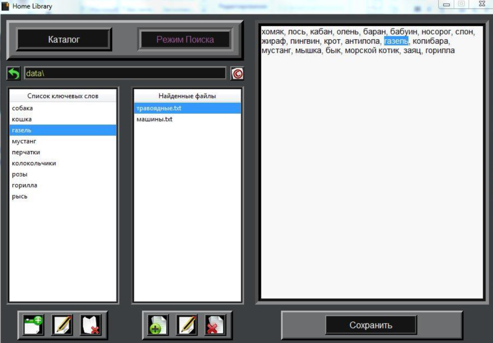

### Курсовая работа на тему:
### Проект поисковой системы

---

#### [Полное описание проекта](https://github.com/nightcarpenter/HomeLibrary/blob/main/HomeLibrary.pdf)

---

#### Было разработано приложение, которое предоставляет следующие возможности:

+ Просмотр текстовых файлов, хранящихся в папках домашней библиотеки.
+ Поиск по ключевым словам в текстовых файлах библиотеки.
+ Удобный графический интерфейс для интуитивной и комфортной работы с библиотекой.

#### Пример работы приложения:

